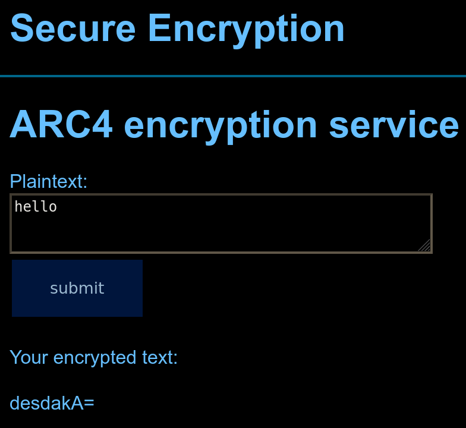

# Write-Up: Secure Encryption

## Task

I don't have the exact wording of the task anymore, but it boiled down to:
> I bet you'll never crack our encryption and that's why we just share
> the encrypted flag with you.
> 
> flag: `UNw8RWv9gLe7Aiv6nqkEkxOvCD1OJEeG8+/Zq463mYvEDkccqQ==`
>
> You can test the cipher out here: https://ctf.mrmcd.net/rc4/

The provided webpage looked like the following. It essentially was just an HTML form
field, which would send one to a new site if the button was pressed. So nothing
fancy. Of course: All the encryption happened on the server side.



*Note*: The reader with a keen eye might have seen the ARC4 and said "hol-up" out
loud in front of their monitor. Well I didn't notice it only after obtaining the
flag.

## Solution

**TL;DR**: The cipher is fairly weak and can be broken using a byte-at-a-time[^1] adaptive
Chosen-Plaintext Attack[^2].

---

As with all things I don't understand, my initial reaction was to play around with
the webpage for a bit. I entered different plaintexts to encrypt, looked at their
outputs and just gathered a bit of information about it. I noticed fairly quickly,
that if two plaintexts start with the same prefix, then the (base 64) ciphertext
would do too. Decoding the base64 data made this behaviour even clearer as can be
seen below.

```
P: hello
C: desdakA=  (base64)
 - 75 eb 1d 6a 40

P: hello_world
C: desdakCQx+r6FSE=  (base64)
 - 75 eb 1d 6a 40 90 c7 ea fa 15 21
```

This opens up a whole range of attack vectors and one of them is the byte-at-a-time
CPA method. This method essentially boils down to decrypting the ciphertext by
iteratively reconstructing the plaintext by repeated calls to the cipher.

In our case we would start by looking only at the first byte and make a call to the
cipher for all possible values. If the ciphertext matches the first byte of the
encrypted flag, we knew the first byte. Now we could repeat this process for the
second byte and so on. See the small schematic drawing

```
  Encrypted flag
  = 50  +  dc  +  3c  +  …
                         
  ⋮             ⋮    ┌►…
  M=50─┐      ┌►M=3c─┘
  N=53 │ ⋮    + N=3f
  O=52 + Q=df │ O=3e
  ⋮    └►R=dc─┘ ⋮
         S=dd
         ⋮
    │      │      │
    ▼      ▼      ▼
    M      R      M   …
  = Decrypted flag
```

> We can actually significantly reduce the search space here, by limiting us to only
> human-readable characters. We know that the flag only contains bytes in the range
> 0x20 (` `) - 0x7E (`~`), so it's okay to only check for bytes in this range.

Putting all of that knowledge into a small Python script we got the flag fairly
quickly. Due to the server being quite slow to answer and me not knowing how to do
request parallelization properly it took us around 10min to decode the 37 byte long
flag.

> `MRMCD2023{n3v3r_r0ll_y0ur_0wn_cryp70}`

### Another approach

As mentioned above, the deployed cipher here is a known one. ARC4[^3] has even been
quite popular in the past. So one of the many ways probably would have been to
extract the key of the cipher with special plaintexts in order to break it.

In contrast, the way we solved it didn't require any knowledge about the algorithm,
except that it is vulnerable to the above described attack vector. In a CTF
competitions one will often hit upon challenges where one doesn't have the
familiarity with the specific topic. But general knowledge about a topic is often
good enough to find a solution - even if it isn't the most elegant way of solving it.

Solved by [Tyalie](https://chaos.social/@tyalie)

[^1]: https://cryptopals.com/sets/2/challenges/12
[^2]: https://en.wikipedia.org/wiki/Chosen-plaintext_attack
[^3]: https://en.wikipedia.org/wiki/RC4
